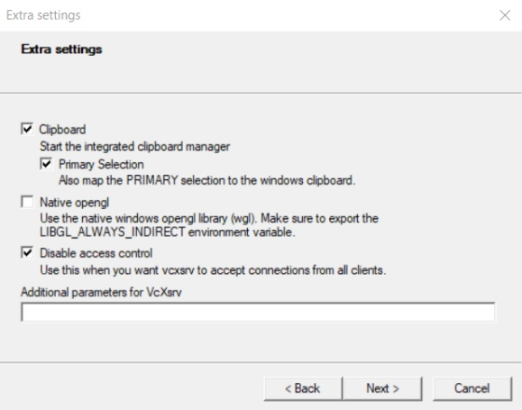

# Communicate with Mbed device with rosserial in WSL2 under Windows10

## There are many environmental issues when trying to use serial communication in WSL2. To solve each of the problems, this tutorial is provided.

### This method is tested under the following condition.

1. Windows 10
2. Nucleo-F103RB
3. WSL2
4. Ubuntu 20.04.4 LTS

## Install WSL

### To install and set up WSL, open a Windows PowerSheel and type:

```
dism.exe /online /enable-feature /featurename:Microsoft-Windows-Subsystem-Linux /all /norestart
```

### To enable WSL2, type also in the PowerSheel:

```
dism.exe /online /enable-feature /featurename:VirtualMachinePlatform /all /norestart
```

### Afterwards, reboot your computer and let the system install WSL2. Then, to make sure WSL2 is selected, type this in a PowerSheel:

```
wsl --set-default-version 2
```

### The system will also automatically install Ubuntu for you.

## Setup GUI

### WSL by default does not support GUI, but you can make it by setting up a GUI server in Windows. To do so, we need a software called VcXsrv Windows X Server. You may download it at: https://sourceforge.net/projects/vcxsrv/



### Once that’s set up, we need to set the DISPLAY environment variable which tells WSL2 where to send the graphics for any application that needs a display to function. To do this, you’ll need to know the IP address for the Windows host machine. You can find this by going to Settings -> Network & Internet and looking under the properties of your current connection (it will probably be labeled as “IPv4 Address”). Then run this command and replace {your_ip_address} with your IP address:

```
echo 'export DISPLAY={your_ip_address}:0.0' >> ~/.bashrc
```

### Now source your edited .bashrc file:

```
source ~/.bashrc
```

### Now everything should be setup for GUI apps to be sent on to Windows for rendering and display. If you want to test the setup, you can install some basic apps within Ubuntu with the below package:

```
sudo apt update
sudo apt install x11-apps
xcalc
```

### If everything is correct, you will see a window pops out and showing a calculator. 

## Install ROS

### Open an Ubuntu terminal and type:

```
sudo apt update
sudo apt upgrade
sudo sh -c 'echo "deb http://packages.ros.org/ros/ubuntu $(lsb_release -sc) main" > /etc/apt/sources.list.d/ros-latest.list'
sudo apt-key adv --keyserver 'hkp://keyserver.ubuntu.com:80' --recv-key C1CF6E31E6BADE8868B172B4F42ED6FBAB17C654
sudo apt install ros-melodic-desktop-fu
echo "source /opt/ros/melodic/setup.bash" >> ~/.bashrc
source ~/.bashrc
sudo apt install python-rosdep python-rosinstall python-rosinstall-generator python-wstool build-essential
sudo apt install python-rosdep
sudo rosdep init
rosdep update
```

### Close all your Ubuntu terminals to restart your WSL Ubuntu. Then open a new Ubuntu terminal to test if everything is working.

```
roscore & rosrun rviz rviz
```

### Everythings is working if you saw rviz windows pop up.

## Setup USB with WSL

### You need to re-build the Ubuntu kernel to enable the USB driver in WSL2. This method is from: https://askubuntu.com/questions/1373910/ch340-serial-device-doesnt-appear-in-dev-wsl/

### Open a Ubuntu terminal and type:

```
sudo apt install build-essential flex bison libssl-dev libelf-dev dwarves libncurses-dev
git clone https://github.com/microsoft/WSL2-Linux-Kernel.git
cd WSL2-Linux-Kernel
make menu-config KCONFIG_CONFIG=Microsoft/config-wsl.
```

### Afterwards, you will see a GUI. Set the following.
### Device Drivers -> USB Support -> USB Serial Converter support
### enable CP210x family by pressing space twice. 
### Then save and exit menu-config and overwrite config-wsl.

### Build the kernel and put it in your Windows user directory.
```
make KCONFIG_CONFIG=Microsoft/config-wsl
cp arch/x86/boot/bzImage /mnt/c/Users/<your-user-name-here>/wsl_kernel
```
### Create a file in your Windows user directory called .wslconfig and paste this into it:
```
[wsl2]
kernel = C:\\Users\\<your-user-name-here>\\wsl_kernel
```
### Shut down WSL in a Windows command prompt.
```
wsl --shutdown
```

### Reopen your Ubuntu.
### Your Ubuntu is now with USB driver, but Windows by default will not attach USB device to WSL. To do so, we need a software called usbipd. This solution is provided at: https://devblogs.microsoft.com/commandline/connecting-usb-devices-to-wsl/

### Install usbipd to your Winsows at: https://github.com/dorssel/usbipd-win/releases/tag/v2.1.0 

### Open a new Ubuntu terminal and type:

```
sudo apt install linux-tools-5.4.0-77-generic hwdata
sudo update-alternatives --install /usr/local/bin/usbip usbip /usr/lib/linux-tools/5.4.0-77-generic/usbip 20
```

### To attach a USB device from Windwos to WSL, open an administrator command prompt on Windows and type
```
usbipd wsl list
usbipd wsl attach --busid <busid>
```

### busid is something like: 1-2

### You may detach the USB device after use by:

```
usbipd wsl detach --busid <busid>
```


## Install rosserial

### rosserial is provided by: http://wiki.ros.org/rosserial_python
### To use this package, pyserial is needed. To install pyserial, pip is needed. To install pip, open a Ubuntu terminal and type:
```
sudo apt update
sudo apt install python3-pip
```
### To check if pip is installed, 
```
pip3 --version
```
### To use pip in WSL, an additional command is needed:
```
export DISPLAY=
pip install <packagename>
```
### Now you can install pyserial:
```
export DISPLAY=
pip install pyserial
```
### To install a ROS package, you need a ROS workspace.
```
cd ~
mkdir ws
cd ws
mkdir src
catkin_make
. /devel/setup.bash
```
### Then you can install the rosserial package into your workspace.
```
cd src
git clone https://github.com/ros-drivers/rosserial
cd ..
catkin_make
. /devel/setup.bash
```
### Now you have installed rosserial, but since you are having python3 by default and rosserial is developed under 2.7.x, you need to modify some code in rosserial.
### In the file: catkin_ws/src/rosserial/rosserial_python/src/rosserial_python/SerialClient.py 
### Change all "write_timeout" to "writeTimeout"

### Now you are ready with rosserial

## Using rosserial


### You can find the device name by
```
dmesg
```
### or
```
dmesg | grep tty
```
### for more specific result. 

### To run any ros node, you need to open a ros core
```
roscore
```
### You can run rosserial with rosrun
```
rosrun rosserial_python serial_node.py _port:=/dev/ttyACM1 _baud:=115200
```
### or you can write a launch file for it
```
<launch>
  <node pkg="rosserial_python" type="serial_node.py" name="serial_node">
    <param name="port" value="/dev/ttyACM1"/>
    <param name="baud" value="115200"/>
  </node>
</launch>
```

### You can publish message by rostopic
```
rostopic pub toggle_led std_msgs/Empty --once
```
### but a more automated way will be write a node for it.

## Write a ros node with C++
### go to the ROS workspace that we have just created and source the bash file.
```
cd ~/ws
source /dev/setup.bash
```
### Add a package to this workspace and re-build the workspace.
```
cd src
catkin_create_pkg pkg_demon std_msgs rospy roscpp
cd ..
catkin_make
```
